# MotoBSD 使用手册

> **MotoBSD 摩托车盲区检测 —— 手机 App 教学手册**
>
> - 适用对象：已安装好 MotoBSD 盲区检测模块的摩托车用户
> - 适用 App 版本：**v1.0.x**（Android 8.0 及以上）
> - 手册版本：v1.0.0　日期：_2026__年_9_月_10_日
> - 配套说明：本手册只介绍**手机端 App 的使用**。模块的装车、接线、固定与雷达朝向属于硬件安装，请以随产品附带的《安装说明书》或售后指导为准（模块装向会影响到 App 的一个设置，见 6.1 节）。

---

## 目录

- [第 0 章 安全须知](#第-0-章-安全须知)
- [第 1 章 认识 MotoBSD](#第-1-章-认识-motobsd)
- [第 2 章 安装 App](#第-2-章-安装-app)
- [第 3 章 首次连接设备](#第-3-章-首次连接设备)
- [第 4 章 三个页面详解](#第-4-章-三个页面详解)
- [第 5 章 骑行使用全流程](#第-5-章-骑行使用全流程)
- [第 6 章 设置与个性化](#第-6-章-设置与个性化)
- [第 7 章 常见问题 FAQ](#第-7-章-常见问题-faq)
- [附录 A 告警颜色与状态速查表](#附录-a-告警颜色与状态速查表)
- [附录 B 真机截图拍摄清单（供制作人员使用）](#附录-b-真机截图拍摄清单供制作人员使用)
- [附录 C 术语表](#附录-c-术语表)

---

## 第 0 章 安全须知

> ⚠️ **请先阅读以下内容**

1. **MotoBSD 是辅助提示设备，不能替代驾驶观察。** 灯带和告警只用于提醒你留意盲区，请务必继续使用后视镜并转头确认，安全骑行永远取决于你自己。
2. **骑行中不要操作手机。** 灯带设计为"余光可感知"，无需盯着屏幕看。所有设置请在停车后进行。
3. **出发前养成 1 分钟检查习惯**：确认 App 显示「已连接」、雷达正常、模块电量充足（见 5.1 节检查清单）。
4. **灯带显示异常时**（如长时间灰色呼吸、长时间没有数据更新），说明连接或设备有问题，请先处理再出发（见第 7 章）。
5. **模块电量不足时请先充电**：低电量可能导致检测不连续。
6. 雨天、夜间或特殊骑行条件下，请更加谨慎，不依赖任何电子辅助。

---

## 第 1 章 认识 MotoBSD

### 1.1 它是什么

MotoBSD 是一套**摩托车盲区检测（BSD）系统**，由两部分组成：

| 部分 | 说明 |
|------|------|
| **车尾模块**（硬件） | 安装在摩托车尾部的毫米波雷达 + 蓝牙模块，负责探测侧后方盲区里靠近的车辆 |
| **MotoBSD App**（本手册主角） | 手机上查看连接状态、目标信息，并在**骑行中把盲区情况显示在手机屏幕边缘** |

模块将检测结果通过**蓝牙低功耗（BLE）**实时传给手机 App。**App 必须连接到模块才能工作**——单独打开 App 没有意义。

### 1.2 一次骑行是怎么工作的

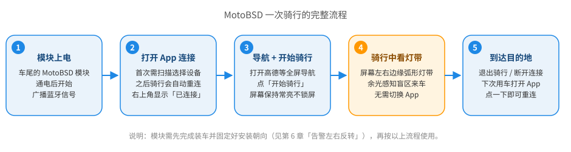

整个过程中你唯一需要操作的，是**出发前连上设备、点一次「开始骑行」**。骑行中你不用再碰手机。

### 1.3 App 的职责

**App 负责：**

- 扫描并连接车尾模块（首次手动选择，之后可自动重连）
- 实时显示盲区目标（状态页的雷达图）
- 骑行时在屏幕边缘叠加**弧形灯带**，余光感知左右盲区
- 探测到危险时发出**声音提示**（可选震动与通知）
- 提供个性化设置（灯带粗细/透明度/声音/安装朝向等）

**App 不负责：** 模块的安装、供电与雷达朝向标定（见随产品的《安装说明书》）。

### 1.4 快速记住三个词

- **盲区（BSD）**：后视镜看不到的侧后方区域，变道/转弯前最危险的地方。
- **灯带**：骑行时叠在导航画面两侧的弧形光带，是本 App 最核心的显示方式。
- **悬浮窗**：灯带能"盖在其他 App 上面"（比如导航地图），靠的是 Android 的悬浮窗能力，需要单独授权（见 3.2 节）。

> 💡 更多名词见 [附录 C 术语表](#附录-c-术语表)。

---

## 第 2 章 安装 App

### 2.1 获取 App

App 是一个安装包（APK）。用手机浏览器打开下面的**下载链接**，或扫右侧二维码下载：

**下载链接：** `https://github.com/Glinfei/moto-bsd-app/releases/download/nightly/app-release.apk`

> 💡 该链接始终指向**最新版安装包**，以后升级版本仍用这个链接下载。
> 💡 打不开或下载慢：先确认网络正常后重试；长按/选中链接复制，粘贴到浏览器地址栏打开。

**系统要求：** Android 8.0 及以上版本；手机支持蓝牙 4.2 或更高（BLE）。大部分 2018 年后手机均满足。

### 2.2 安装步骤

1. 用手机浏览器打开下载链接（或用相机扫二维码）。
2. 下载完成后点击通知或文件管理器里的 APK 文件。
3. 若系统提示"**禁止安装未知来源应用** / 出于安全考虑不允许安装"，点击**设置 / 允许此来源**后返回重试（不同品牌手机路径不同，一般在"设置 → 应用与通知 → 特殊应用权限 → 安装未知应用"附近）。
4. 点击**安装**，等待完成，点击**打开**。

> 💡 如果通过微信/QQ 传输 APK，打开时可能被拦截，请用浏览器直接下载更稳妥。

### 2.3 首次启动：欢迎引导

第一次打开 App 会进入 **4 屏欢迎引导**（纯介绍页）：

1. **MotoBSD** —— 产品一句话介绍
2. **蓝牙连接** —— 提示需要蓝牙和定位权限
3. **悬浮指示** —— 提示悬浮窗权限
4. **告警通知** —— 提示通知权限

看完点右下角**下一步**，最后一屏点**开始使用**进入主界面（状态页）。
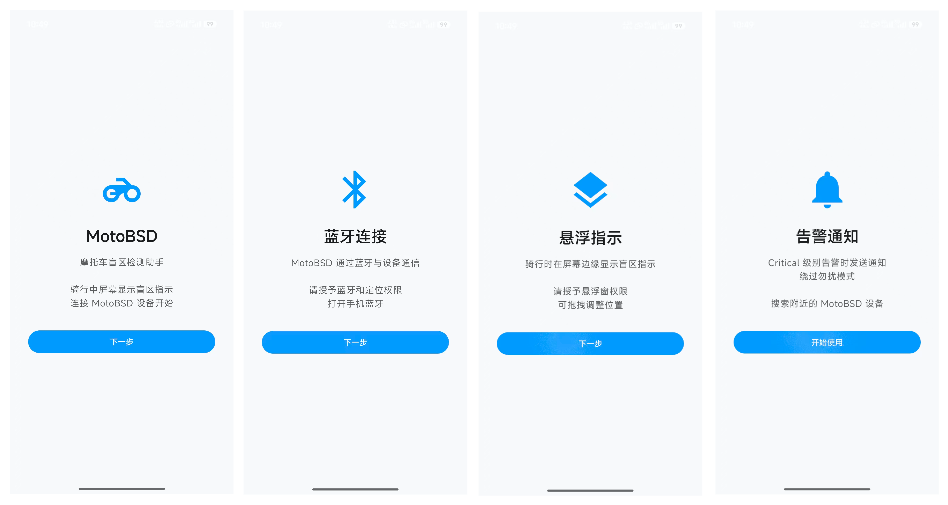

---

## 第 3 章 首次连接设备

### 3.1 连接前的准备清单

| 检查项 | 说明 |
|--------|------|
| 模块已装车并**通电** | 通电后模块自动开始蓝牙广播 |
| 手机**蓝牙已打开** | 下拉通知栏打开蓝牙开关 |
| 手机与模块距离 **10 米以内** | 首次配对请靠近车身 |
| 模块电量充足 | 首次使用前建议先充满 |

> 💡 不知道模块是否在广播？观察模块电源指示灯，或先跳过，直接按 3.3 节去扫描，扫到了就说明它在工作。

### 3.2 首次打开需要授权（一次性）

首次使用系统会弹窗询问若干权限，**建议全部点"允许"**：

| 系统版本 | 会询问的权限 | 用途 |
|----------|--------------|------|
| Android 12+ | **蓝牙扫描 / 连接附近的设备** | App 靠它搜索并连接模块 |
| Android 8~11 | **位置（定位）权限** | 该系统版本扫描蓝牙需要位置权限（App 本身不用你的位置） |
| Android 13+ | **通知** | 否则收不到连接状态与告警通知 |

> 📷 拍摄说明：Android 13+ 手机首次打开 App 时的"扫描附近设备"系统弹窗（若还能复现）；不同手机弹窗样式不同，示意即可。

**悬浮窗权限（重要）**：首次进入 App 时会自动跳转到系统的悬浮窗设置页，请：

1. 找到 **MotoBSD**；
2. 打开"**显示在其他应用上层 / 悬浮窗 / 允许显示在顶层**"这类开关；
3. 返回 App。

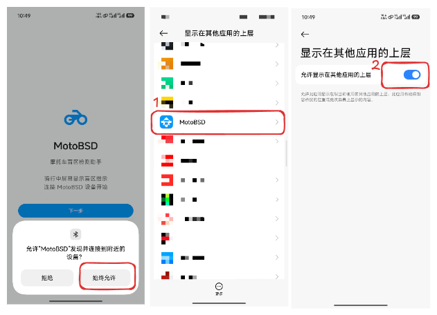

> 📷 拍摄说明：Android"设置 → 应用 → MotoBSD → 悬浮窗/显示在其他应用上层"的开关页截图（不同品牌位置可能不同，截你手机实际路径即可）。

> ⚠️ 悬浮窗权限**没开的话**：状态页正常，但骑行时**导航上看不到灯带**，也无法用"屏幕常亮"。之后随时可补：见 4.3 节"悬浮窗指示"开关，或 [FAQ Q5](#faq-q5导航上没有灯带或灯带不显示)。

### 3.3 连接设备（核心步骤）

**第 1 步：进入扫描页**

主界面（状态页）右上角如显示「未连接」，点击底部**大蓝色按钮「扫描设备」**，进入"选择设备"页面（页面会自动开始扫描）。

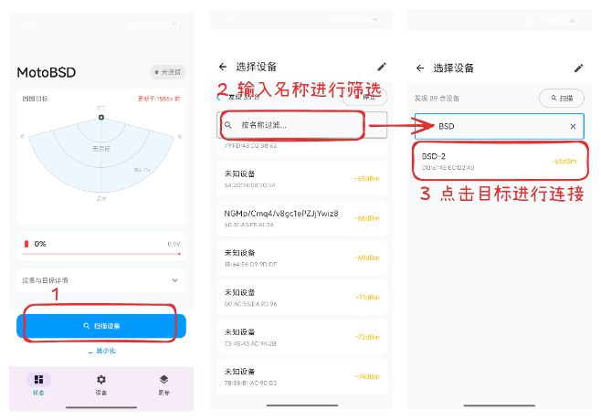
> 📷 拍摄说明：扫描列表页，列表里要有 1 个带 MotoBSD 蓝标的设备（可多留几行其他蓝牙设备作对比）。

**第 2 步：看懂扫描列表**

| 界面元素 | 含义 |
|----------|------|
| 顶部"发现 N 台" | 当前扫到的蓝牙设备数量 |
| 设备名称 | MotoBSD 设备带**蓝色「MotoBSD」标签**，且排在列表最前面 |
| MAC 地址 | 设备唯一地址（形如 `AB:CD:EF:01:02:03`），用于区分同名设备 |
| 右侧数字（如 `-52dBm`） | 信号强度：绿色=好，黄色=一般，红色=弱；**数字越大（越接近 0）信号越好** |
| 右侧"已连接" | 绿色小字，表示这台正是当前连接的设备 |
| 右侧转圈 | 正在连接这台设备 |
| 顶部输入框 | 按名称过滤，输入"BSD"能快速找到 |

**第 3 步：点选你的模块**

点击名称带 **MotoBSD** 标签的那一项。连接成功后会自动回到状态页，此时：

- 状态页右上角变为**绿色「已连接」**胶囊（内含 4 格信号条）；
- 通知栏出现常驻通知 **"MotoBSD · ⚡ 已连接"**；
- 雷达图卡片右上角出现 **"实时"** 字样。

> 💡 **扫描不到？** 先确认蓝牙已开、模块已通电、人已靠近车身，然后点右上**停止**再点**扫描**重试。还不行请看 [FAQ Q1](#faq-q1为什么扫描不到设备)。

**手动输入 MAC 连接（进阶）**

在"选择设备"页右上角点**铅笔图标**，可手动输入模块 MAC 地址后点**连接**。适合扫描列表里找不到、但你已知模块 MAC 的情况（MAC 一般印在模块标签上或出厂资料里）。

### 3.4 怎么断开连接

连接状态下，状态页底部第二行有红色**「断开连接」**文字按钮。

- 断开后 App 停止占用蓝牙，也不会再自动重连；
- 下次使用：打开 App，按 3.3 节重新扫描连接，或用状态页的**「重连上次设备」**（见下）。

### 3.5 断线时的"一键重连"

如果之前连过设备，后来**断线或连接失败**，状态页会出现一个描边按钮 **「重连上次设备」**：

- 点击后 App 自动去连上次那台模块（自动尝试 3 次，不行会提示"未找到设备：请确认设备已开机并在附近"）；
- 骑行中意外断线则是 App **自动重连**（最多 10 次，间隔最长 30 秒），见 5.6 节。

> 💡 以上是"第一次使用"的完整路径。装好后日常使用基本只剩：**打开 App → 已自动连上 → 开始骑行**。

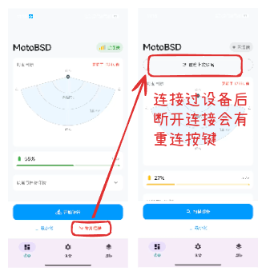

## 第 4 章 三个页面详解

App 主界面底部有三个标签：**「状态」「设备」「图标」**。

> ⚠️ 说明：第三个标签目前显示为**「图标」**，但它里面其实是**悬浮灯带与声音设置**。这是界面文案的历史遗留，后续版本可能改名。为了让你看懂，本手册把它叫作 **"灯带设置页"**，并在步骤里注明它对应的底部标签是**「图标」**。

| 标签 | 页面 | 用途 |
|------|------|------|
| 状态 | 状态页 | 连接状态、周围目标雷达图、电量、骑行操作（**用得最多**） |
| 设备 | 设备页 | 查看/修改设备信息、固件升级、雷达电源、重启设备 |
| 图标 | 灯带设置页 | 悬浮灯带外观、测试告警、声音、朝向与反转（**次常用**） |

### 4.1 状态页（主页面）

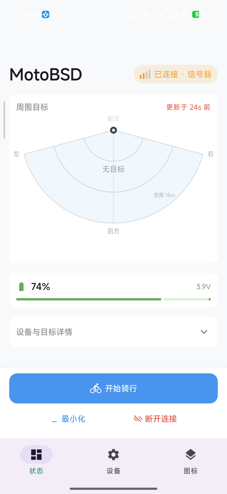

> 📷 上图为你提供的真实截图（示例中"信号弱 / 更新于 24s 前"是当时环境下的正常显示，不代表故障）。正式发布前可替换为一张状态更干净的截图。

#### ① 顶部：连接状态胶囊

右上角胶囊显示当前连接状态：

| 显示 | 颜色 | 含义 |
|------|------|------|
| 未连接 | 灰 | 还没连接模块（点底部「扫描设备」） |
| 扫描中 / 连接中 | 蓝 | 正在搜索 / 正在建立连接 |
| 重连中（第 N 次） | 蓝 | 意外断线，App 正在自动重连（见 5.6） |
| 已连接（4 格信号条） | 绿 | 连接正常 |
| 已连接 · 信号弱 | 橙 | 连上了但信号差（RSSI 低于 -80） |
| 连接失败 | 红 | 重试耗尽，下方会显示失败原因 |

**信号条解读**（已连接时胶囊内显示 4 格小竖条，信号每 5 秒刷新一次）：

| 信号条 | 对应信号强度 | 建议 |
|--------|--------------|------|
| 4 格（绿） | RSSI ≥ -60 | 很好 |
| 3 格（黄） | -60 ~ -75 | 良好，正常骑行可用 |
| 2 格（橙） | -75 ~ -85 | 一般，注意观察是否掉线 |
| 1 格（红） | 低于 -85 | 差，容易断线，请靠近模块 |

胶囊呈**橙色并出现"信号弱"**时（RSSI < -80），说明手机与模块距离远或被遮挡，骑行中要留意重连情况。

**失败原因**：连接失败时标题下方会有一行红字说明原因，例如"未找到设备：请确认设备已开机并在附近"，按提示处理即可。

#### ② 周围目标卡（雷达视图）

卡片标题 **"周围目标"**，右侧是**数据新鲜度**：

- **实时**（灰色）：5 秒内刚收到过雷达数据，一切正常；
- **更新于 Ns 前**（>5 秒变红）：已经有一阵没收到数据了——数据可能断了，请留意连接；
- **等待数据…**（红色）：刚连上还没收到第一笔数据。

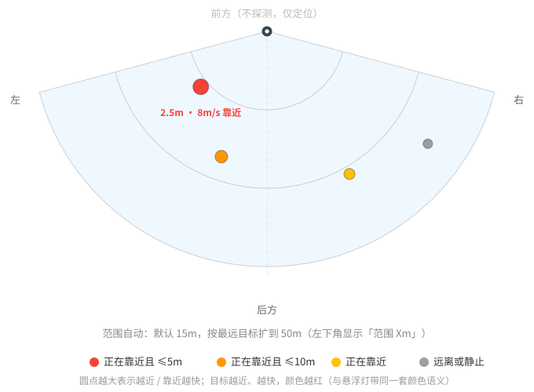

雷达图画的是**俯视图**，把"车尾 + 侧后方扇形探测区"摊开给你看：

- **顶部圆点 = 模块（车尾）位置**，扇区向下方（车后）张开；
- **前方（上）**不探测，只是方向参考；探测区在**后方 ±75°** 范围；
- **每个圆点 = 一个被探测到的目标**：越靠下越远，越靠两侧角度越大；
- **圆点颜色 = 危险程度**（与灯带同一套语义，见下表）；
- 圆点下方最近目标会有标签，例如 `3.2m · 6m/s 靠近`（距离 · 速度 · 靠近/远离/静止）；
- 左下角显示 **范围 Xm**：范围会自动适配，默认 15m，有远目标时扩展到最远 50m；
- 画面中间没有点时显示灰色 **"无目标"**。

| 目标颜色 | 含义 |
|----------|------|
| 红 | 正在靠近且距离 ≤ 5m（危险） |
| 橙 | 正在靠近且距离 ≤ 10m |
| 黄 | 正在靠近（较远） |
| 灰 | 正在远离，或相对静止 |

雷达图下方还有**左右两列"目标记录"**：记录该侧最近几次出现的车辆（格式 `时间 距离 角度`，如 `09:12:33  3.2m  -12°`）。目标消失后记录保留 60 秒并以灰色显示，方便你回看刚才的情况。

#### ③ 设备与目标详情（可折叠）

点击"**设备与目标详情 ▾**"可展开更多信息：

- **最近目标**：按距离取最近的前 2 个，显示哪一侧、距离、角度、速度与靠近/远离；
- **温度**：模块当前温度（℃）；
- **USB**（蓝色，仅当检测到 USB 连接时出现）：模块正通过 USB 供电/充电；
- **雷达**：`雷达 ●`（绿色）＝雷达在线工作；`雷达 ○`（灰色）＝雷达未上电。

#### ④ 电量卡

常驻在雷达卡下方，是**骑行前必看**的信息：

- 百分比 + 电压（如 `82%` + `3.9V`）；
- 进度条颜色：**绿**（≥50%）/ **黄**（20~50%）/ **红**（<20%）。

> ⚠️ 电量低于 20%（红色）建议先给模块充电再出门，低电量会直接影响检测稳定性。

#### ⑤ 底部操作栏

底部固定两个层次的操作按钮，含义随连接状态变化：

| 当前状态 | 大按钮 | 第二行 |
|----------|--------|--------|
| 未连接 / 连接失败 | **扫描设备** / 重试扫描 | 最小化 |
| 扫描中 / 连接中 / 重连中 | **停止扫描** / 取消重连 | 最小化 |
| 已连接 | **开始骑行**（骑行中变绿色**「退出骑行」**） | 最小化 · 断开连接（红字） |

- **开始骑行**：一键进入骑行模式——启动后台连接服务、悬浮灯带，并让**屏幕常亮不锁屏**，然后 App 自动退到后台（见第 5 章）；
- **最小化**：App 退到后台、灯带继续工作，但**不**强制屏幕常亮（适合停车查资料、等红灯临时切出去）；
- **断开连接**：手动断开（断开后不自动重连，且会自动退出骑行模式）。

### 4.2 设备页（底部"设备"标签）

<!--  -->

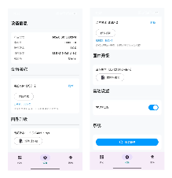
> 📷 拍摄说明：连接状态下打开"设备"标签整页截图；设备信息栏需有实际内容（如固件版本号）。

按区块说明：

**① 设备信息**

显示模块的产品型号、序列号、硬件版本、**固件版本**、制造商。售后或升级前核对版本就靠这里。

**② 设备名称**

- 「当前名称」＋「刷新」按钮（重新读取模块里的名称）；
- 「修改名称」：输入新名字（**最长 20 字节**。注意：一个汉字约占 3 字节，输入约 6 个汉字就到上限了），点「保存」；
- 保存成功会提示"名称已更新（重连后生效）"——**断开重连后**，扫描列表里才会显示新名称。

**③ 固件升级（DFU，进阶操作）**

当厂家发布新版模块固件并**提供升级包（.zip 文件）**时才需要操作：

1. 把升级包放到手机（从官方渠道下载，注意核对版本）；
2. 确认模块已连接、电量充足；
3. 点击「**选择升级包**」，在文件选择器里选 .zip 文件；
4. 设备会自动重启进入升级模式，随后自动传输升级文件；
5. 系统通知栏会显示 **"固件升级"** 进度，请耐心等待完成；完成后设备自动重启并尝试重连。

> ⚠️ 升级期间请保持：手机与模块靠近、**不要断电**、不要关闭蓝牙或强退 App。当前版本升级**没有断点续传**，若中途失败，重新操作一次；仍失败请联系售后，不要自行反复折腾。

> 💡 没有厂家通知时，**不需要也不建议**自行升级。

**④ 雷达设置**

「雷达电源」开关对应模块雷达是否上电工作（绿色＝工作中）。一般由模块自动管理，**不用手动去动它**；若关掉了，雷达图将长时间没有数据，记得把它打开。

**⑤ 系统**

「重启设备」按钮：让模块软重启（会弹出确认框）。**当设备疑似"卡住"、数据异常时，先试这个**，比断电更温和。

### 4.3 "图标"标签 → 灯带设置页

进入方式：底部点**「图标」**。整页内容较多，从上到下依次是：

![图 4-4 灯带设置页·上半部分（待补截图）]image-6.png)

> 📷 拍摄说明：截图页面上半部分，包含"灯带粗细 / 透明度 / 测试告警"三个区块（左、右都显示 安全）。

#### ① 灯带粗细 与 ② 透明度

- **灯带粗细**：细 / 中 / 粗 三档（出厂默认**中**）；
- **透明度**：滑杆 35% ~ 100%（出厂默认 **60%**）。注意**下限是 35%**，防止你调太淡、户外看不清。

#### ③ 测试告警（强烈建议先玩这个）

不用骑车就能预览灯带和声音效果：

- 左、右各有「**切换**」按钮，每点一次在 **安全 → 警告 → 警惕 → 危险** 之间循环；
- 切换后**灯带会实时点亮对应颜色**，同时播放对应告警声——正好用来检查左右和声音（配合 6.1 节确认朝向）；
- 预览完点「**重置为安全**」恢复真实数据。

> ⚠️ 测试状态会一直持续到点"重置为安全"。如果测试完忘了重置，骑行时灯带会一直显示测试的告警状态——出发前记得点一下"重置为安全"。

#### ④ 声音设置

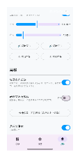

> 📷 拍摄说明：同一页往下滚，截"声音设置 / 高级 / 光带位置 / 悬浮窗指示"区域（可分上下两张）。

| 项目 | 说明 | 默认 |
|------|------|------|
| 音量 | 告警音大小（0~100%） | 70% |
| 告警音量跟随 | **媒体音量**：跟手机媒体音量走，推荐，支持蓝牙耳机；**闹钟音量**：走闹钟通道，更响，可穿透其他声音 | 媒体音量 |
| 左频 | 左侧告警音的音调（100~2000 Hz），**默认 1000Hz（偏高）** | 1000 Hz |
| 右频 | 右侧告警音的音调，**默认 400Hz（偏低）** | 400 Hz |

- **为什么左右音调不同？** 听到"高音"知道是左边来车、低音是右边，不用看屏幕。
- **试听按钮**：`🔊 试听左声` `🔊 试听右声`（警告级提示音）；`⚠ 试听左急` `⚠ 试听右急`（危险级急促音）。调节后点试听确认效果。

> 💡 告警音说明：检测到一侧有目标（警告级）时，该侧开始播放"3 短声"提示音，约每 3 秒一轮；危险级是更急促的"5 短声"，且会伴随通知与震动。左侧若为危险级，音调会在你设定的左频基础上再升高 20%（上限 2500Hz），让你更容易警觉。

#### ⑤ 高级：两个"反转"

**「告警左右反转」**（默认**开**）：

- 模块默认**朝后安装**，此时模块自身的"右"对着骑手的"左"，所以 App 要把左右对调回来，才能让"左边有车 → 亮左边"；
- 开关说明文字里写得很清楚：*模块朝后安装时模块右侧=骑手左侧，需要反转。若模块朝前安装请关闭。*
- **只有模块真的朝前安装时才关闭它**，否则左右会反（详见 6.1 与图 6-1）。

**「悬浮窗左右反转」**（默认关）：

- 只把悬浮窗灯带的**显示**左右镜像，**不影响**告警声音和通知的方向判断；
- 一般用不到，仅当手机固定方式特殊（比如横屏时觉得灯带贴反了）才考虑。

#### ⑥ 光带位置

按钮显示当前状态，点击切换：**"光带位置：左右边缘（点击切上下边缘）"**。

- **左右边缘**：灯带贴屏幕左右两侧（竖屏导航常用）；
- **上下边缘**：灯带贴屏幕上下（横屏导航常用）。

#### ⑦ 悬浮窗指示（总开关）

页尾的"悬浮窗指示"开关控制灯带是否显示，状态显示"当前显示中 / 当前已关闭"：

- **默认开启**，首次进入 App 就会自动运行；
- 关闭后再打开，如果系统没给悬浮窗权限，会提示"请先在系统设置中开启悬浮窗权限"——按提示去系统设置打开即可（见 3.2 节）；
- 关掉后灯带消失；需要时再打开即可。

---

## 第 5 章 骑行使用全流程

### 5.1 出发前 1 分钟检查清单

| 顺序 | 检查 | 怎么看 |
|------|------|--------|
| 1 | 模块已通电 | 随车安装完成后模块应随车电自动启动 |
| 2 | 打开 App | 右上角应显示**已连接**（一般自动重连上次设备，几秒内完成；没连上就按 3.3 节手动连接） |
| 3 | 信号 | 已连接胶囊至少 **3 格**（黄）以上，避免红格 |
| 4 | 电量 | 电量卡 ≥ **50%**（绿）；红色请先充电 |
| 5 | 悬浮窗 | 如果上次关过，确认「图标」页"悬浮窗指示"为开 |
| 6 | 测试复位 | 若上次玩过"测试告警"，确认已**重置为安全** |

### 5.2 开始骑行

1. 打开导航 App（高德、百度等），设好目的地，**进入全屏导航**；
2. 切回 MotoBSD，点底部大按钮**「开始骑行」**；
3. App 自动退到后台，导航回到前台——这时屏幕左右边缘已经挂上灯带，且**屏幕不会自动熄屏**。

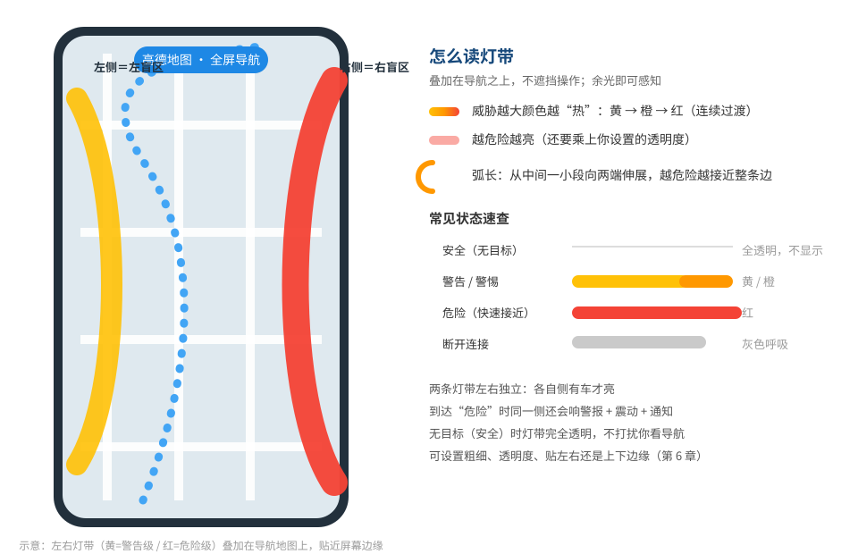
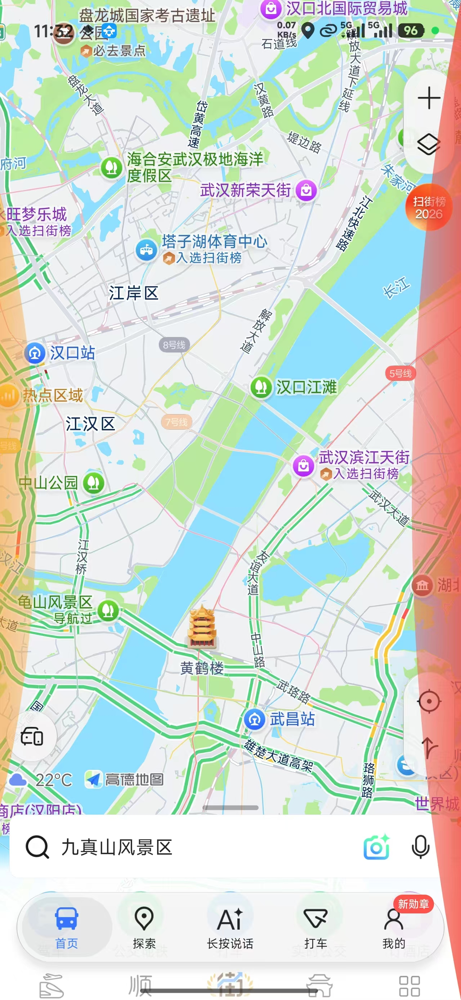
> 💡 若点「开始骑行」后提示未开启悬浮窗权限、无法保持常亮，请先去系统设置打开悬浮窗权限（3.2 节），再回来重试。

**骑行中按钮变绿色「退出骑行」**：退出骑行模式＝恢复自动锁屏。连接**不会**断开，灯带是否继续显示取决于 App 是否在后台运行。

> ⚠️ 提示：开始骑行依赖"屏幕常亮"，会明显增加手机耗电，请确认手机有供电（或充电支架）。

### 5.3 骑行中怎么"看"灯带

参考图 5-1：

- **左侧灯带 = 左盲区，右侧灯带 = 右盲区**，各自独立；
- 颜色从**黄 → 橙 → 红**随威胁连续加深：目标越近、靠近越快，灯带越红、越亮、越长；
- **弧长从中间一小段向两端伸展**——看到弧"变长变红"就该准备收油/观察了；
- **安全（无目标）时完全透明**，不遮挡导航；
- 灯带贴在屏幕边缘、不可点击，不会挡到导航操作和手势。

颜色与动作速查见 [附录 A](#附录-a-告警颜色与状态速查表)。

### 5.4 骑行中的声音与震动

| 情况 | 你会听到/看到 |
|------|----------------|
| 一侧探测到目标 | 该侧**提示音**循环（约 3 秒一轮"3 短声"）；高音=左、低音=右（按你的 4.3 设置） |
| 危险级 | **急促音**（5 短声、间隔短）+ 手机**震动** + 系统**通知**"⚠ 左/右盲区告警！有车辆靠近，请注意安全" |
| 两侧同时有目标 | 危险级的那侧优先，同级时左侧优先；两侧都安全后声音自动停止 |

> 提示：灯带的颜色深浅**实时反映**目标远近与靠近速度；声音节奏与通知/震动则按"告警级别"触发（目前由设备固件决定哪些情况会判定为危险级，可能随固件升级调整）。

几个实用提示：

- 默认走**媒体音量**，手机连着蓝牙耳机时通常能听到（耳机媒体音量调大即可）；
- 想让它"特别响、手机静音也响"，在「图标」页把"告警音量跟随"切到**闹钟音量**（注意别打扰到别人）；
- 不想听声音可以只留灯带吗？目前声音与灯带联动，暂不支持单独静音告警音；请先调低音量（可到 0）。

### 5.5 到达目的地

1. （可选）回到 App，点绿色**「退出骑行」**——恢复自动锁屏；
2. （可选）长按或点底部红色**「断开连接」**——完全断开；
3. 或者什么都不做：App 在后台继续工作，锁屏后连接仍在，下次打开直接可用。

> 💡 断开连接后 App 的后台服务会停止、通知消失，也不会耗蓝牙。

### 5.6 骑行中断线怎么办

骑行中可能因距离远、遮挡等原因临时断线，这是**正常现象**，App 会这样处理：

1. **自动重连**：断线瞬间开始重连，状态页显示"重连中（第 N 次）"（最多尝试 10 次，间隔从 1 秒逐渐拉长到 30 秒）；
2. **灯带变灰色呼吸**：断线期间悬浮灯带整条变成**灰色、缓慢明暗呼吸**——这是"断线中"的信号，与"安全=透明"明确区分；
3. 重连成功后恢复显示；连续失败 10 次后停止，显示红色"连接失败"，需要你手动处理（停车后点「重连上次设备」或重新扫描）；
4. 如果你知道是暂时离开（例如进加油站、离车几步），可以点**「取消重连」**停止自动尝试。

> ⚠️ 如果骑行中频繁掉线，多半是信号问题，参考 [FAQ Q4](#faq-q4信号弱或反复断线怎么办) 改善。

---

## 第 6 章 设置与个性化

### 6.1 安装朝向与「告警左右反转」（重要）

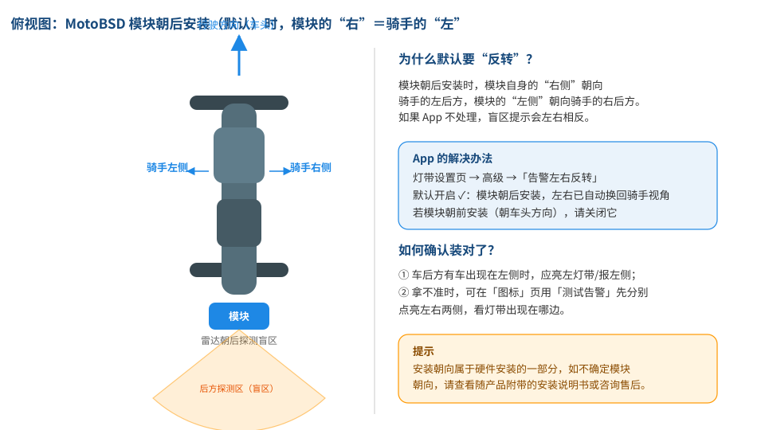

- 模块**默认朝后安装**（雷达朝车尾方向探测盲区），此时必须保持「告警左右反转」为**开**（出厂默认即开，正常情况不用动）；
- **只有模块朝前安装**时才需要把它关掉；
- **怎么确认装对了？** 用「图标」页的**测试告警**分别点亮左侧和右侧，看灯带出现在你期望的那边（或听声音的高低侧）；仍拿不准就咨询售后。

### 6.2 灯带外观调整

按自己习惯在「图标」页调整：

| 想要的效果 | 调整 |
|------------|------|
| 觉得灯带挡视线 | 调低透明度（不低于 35%）或改"细" |
| 户外强光下看不清 | 调高透明度（最高 100%）或改"粗" |
| 竖屏导航 | 光带位置选"左右边缘" |
| 横屏导航 / 手机横置 | 光带位置选"上下边缘" |

调整是**实时生效**的，挂着的灯带立刻变化，不用重启。

### 6.3 声音个性化建议

1. 先在「图标」页把音量调到 70% 左右；
2. 用**试听左声 / 试听右声**感受默认音调（左 1000Hz / 右 400Hz）；
3. 若和你的蓝牙耳机/头盔耳机配合不好（听不清低音），可把右频也调高些，让两边都清晰可辨——**前提是两边音调仍然明显不同**；
4. 使用头盔蓝牙耳机时保持默认"媒体音量"，并把手机媒体音量开大；
5. 手机静音需求强（怕吵）但还要提示音，试试"闹钟音量"档。

### 6.4 悬浮窗权限与开关

- 灯带显示依赖：系统**悬浮窗权限** + App 内**「悬浮窗指示」开关**，两者都满足才显示；
- 常见排查顺序：系统设置给权限 → App「图标」页开关打开 → 状态页确认已连接（断线时灯带是灰的呼吸，不是故障）。

### 6.5 什么时候用"测试告警"

- 刚装好、**确认左右朝向**对不对（配合 6.1）；
- 静止时给朋友演示产品效果；
- 不骑车想先听听告警声、调调音量。

## 第 7 章 常见问题 FAQ

### FAQ Q1：为什么扫描不到设备？

按顺序排查：

1. 手机蓝牙是否已打开？选择设备页会提示"请先打开手机蓝牙"。
2. 模块是否**已通电**？通电后约几秒内开始广播；刚通电请等 10 秒再扫。
3. 是否**靠近车身**（10 米内）？隔着墙壁、金属壳都会影响。
4. 点右上角**停止**，再点**扫描**重新搜一次。
5. 确认手机给了**蓝牙/位置权限**（3.2 节），权限被拒时无法扫描。
6. 附近蓝牙设备很多时用顶部过滤框输入 `BSD` 快速找。
7. 还找不到：模块可能坏了或未进入广播状态，联系售后；已知 MAC 可试手动输入连接（3.3 节末尾）。

### FAQ Q2：首次使用被系统反复要求授权 / 授权时点错了怎么办？

首次进入 App 会依次请求蓝牙、通知权限，并自动打开一次悬浮窗设置页。点错或拒绝都没关系，随时可以补：

- 一般路径：手机**设置 → 应用 → MotoBSD → 权限**，把需要的权限打开；
- 悬浮窗权限在"**特殊应用权限 → 显示在其他应用上层（悬浮窗）**"里；
- 打开后回到 App 即可，无需重装。

### FAQ Q3：一直提示"连接失败：未找到设备"？

- 说明 App 重试多次仍连不上那台设备（手动重连 3 次、自动重连 10 次都用完了）。
- 处理：确认模块**开机且就在附近** → 点「**重连上次设备**」重试；仍失败就重新**扫描连接**（3.3 节）。
- 如果是刚改了设备名称，扫描列表需重连后才显示新名字（不是故障，见 4.2）。

### FAQ Q4：信号弱或反复断线怎么办？

- 看状态页胶囊：出现"已连接 · **信号弱**"或信号条降到 1~2 格，就是信号问题。
- 改善：靠近模块（手机装在车把/支架上离模块更近更稳）；检查手机与模块之间有没有金属遮挡（油箱、尾箱、金属手机壳）；模块天线位置可咨询安装方。
- 骑行中断线是常态场景：App 会自动重连最多 10 次，灯带会呈灰色呼吸提示你（5.6 节），不必慌张，重连成功即恢复。

### FAQ Q5：导航上没有灯带或灯带不显示？

依次检查三个条件，缺一不可：

1. **系统悬浮窗权限**已给（3.2 节 / FAQ Q2）；
2. 「图标」页底部**「悬浮窗指示」开关**为开，状态显示"当前显示中"；
3. 已连接模块（断开时灯带不显示；断线中则是灰色呼吸，不是灯带消失）。

另注意：**安全（无目标）时灯带是透明的**——路上没车就是"看不到"，这是正常设计，可以用「图标」页的测试告警确认灯带本身在正常工作。

### FAQ Q6：灯带出现了，但我觉得左右不对？

1. 检查「图标」页 → 高级 →「**告警左右反转**」是否与你模块的实际安装朝向一致（默认开 = 朝后安装，见 6.1 与图 6-1）；
2. 「**悬浮窗左右反转**」一般应保持关闭（它只是把显示镜像，别和上面那个搞混）；
3. 用**测试告警**分别点左/右，看灯带与声音出现在哪一侧来验证。

### FAQ Q7：不响声音，或者声音很小？

- 默认告警音跟随**媒体音量**：把手机媒体音量调大（可能被蓝牙耳机/导航语音抢走音量，确认耳机媒体音量）；
- 手机**静音**时若选了"媒体音量"档就没声——可切到"闹钟音量"档（4.3 节）；
- 「图标」页"音量"滑杆是否被调到 0 或很低；
- 只响铃不震动／只震动不响铃：震动与危险级通知绑定，警告级只有声音没有震动，属正常设计；
- 试听按钮（试听左声等）能响、实车不响：说明当时没有检测到目标——只在"一侧有目标"时才响，安全状态本就无声。

### FAQ Q8：通知栏一直有一条 MotoBSD 的通知？

那是**常驻连接通知**（"MotoBSD · ⚡ 已连接 / ⟳ 重连中…"），是 App 在后台工作的标志，不是广告：

- 已连接时正文会实时显示"左：警告 右：安全"这类盲区状态；
- 想彻底去掉它：在状态页点**「断开连接」**，后台服务停止后通知自动消失；
- 注意：断开连接后灯带与告警也不再工作。

### FAQ Q9：雷达图上长时间显示红色"更新于 XXs 前"？

- 说明超过 5 秒没收到模块数据了（数据断或模块停止上报）。
- 处理：看连接是否已断（右上角状态）；若"已连接"却一直无数据，试试设备页**重启设备**、检查雷达电源是否被关闭；仍异常联系售后。

### FAQ Q10：雷达电源开关被关了/数据一直空怎么办？

- 「设备」页 → 雷达设置 →「雷达电源」打开（开关为绿色）即可；
- 模块重启后雷达一般会自动恢复上电，若没有，手动打开一次。

### FAQ Q11：改的设备名称不生效？

- 名称保存在模块里，写入成功后提示"重连后生效"：请**断开再重连**一次，扫描列表就会显示新名称；
- 注意 20 字节上限（约 6 个汉字），超长会保存失败或截断。

### FAQ Q12：固件升级失败或卡住怎么办？

- 确认条件：模块已连接、电量充足、升级包来自官方且型号匹配；
- 升级中手机不要锁屏断蓝牙、模块不要断电；
- 失败后设备一般会自动恢复正常固件运行，重新升级一次即可；反复失败请联系售后（当前版本升级无断点续传，见 4.2）。

### FAQ Q13：怎么让模块重启？

「设备」页最下方「**重启设备**」→ 确认。模块软重启，几十秒后会自动重新广播并重连。

### FAQ Q14：为什么手机掉电快？

- 骑行模式会**强制屏幕常亮**（这是功能不是故障），耗电明显增加，建议用充电支架供电；
- 后台保持连接也会持续耗电；不需要时在状态页**断开连接**，后台服务会停止。

### FAQ Q15：底部第三个标签为什么叫"图标"？里面明明是灯带和声音设置？

这是界面文案的历史遗留：该标签对应的是**悬浮灯带（悬浮窗指示）与声音设置**页。本手册把它称为"灯带设置页"，后续版本可能会把标签改得更直白。放心按"底部第三个标签 = 灯带设置"使用即可。

---

## 附录 A 告警颜色与状态速查表

| 场景 / 状态 | 悬浮灯带 | 声音 | 通知 / 震动 | 含义 |
|-------------|----------|------|-------------|------|
| 安全（无目标） | **全透明**（不可见） | 无 | 无 | 该侧盲区没有车 |
| 警告 | 黄色 | 黄侧"3 短声"提示音（约 3 秒一轮） | 无 | 该侧探测到目标 |
| 警惕 | 橙色、变亮变长 | 同上 | 无 | 目标更近 / 靠近更快 |
| 危险 | 红色、最亮、接近整条边 | 急促"5 短声" | ⚠ 通知 + 震动（同侧 30 秒内不重复） | 快速接近，请立即观察 |
| 断线 / 重连中 | 整条**灰色缓慢呼吸** | 无 | 常驻通知变为"重连中" | 连接断开，正在自动重连 |
| 未连接（用户手动断开） | 不显示 | 无 | 常驻通知"未连接"或消失 | 需手动重新连接 |

> 注：悬浮灯带是**连续**变化（黄→橙→红按威胁程度渐变，威胁由"距离 + 靠近速度"决定），上表用四级帮助理解。实车数据下的级别展示以状态页通知文案（左/右：安全/警告/警惕/危险）和灯带颜色为准。

## 附录 B 真机截图拍摄清单（供制作人员使用）

> 使用说明：本手册正文中的截图目前是**占位状态**（图片不存在时会显示裂图）。请按本清单在真机上拍摄后，把图片放入本手册同目录的 `images/` 文件夹，**文件名与下表"文件名"列一致**即可自动替换（无需改正文）。
>
> 建议：用一台干净的手机拍摄；截面前先清空通知栏、把亮度调正常；竖屏全页面截图；图片用 PNG/JPG 均可。

| 图号（正文引用） | 文件名 | 页面 / 状态 | 拍摄要点 |
|------|--------|-------------|----------|
| 图 2-1 | `fig2-1_download_qrcode.png` | App 下载二维码 | **已生成**（官方下载链接二维码），无需拍摄 |
| 图 2-2 | `fig2-2_onboarding.png` | 首次引导页 | 4 屏中截最有代表性 1~2 屏，或 4 屏竖排拼图 |
| 图 3-1 | `fig3-1_permission_ble.png` | 系统权限弹窗（蓝牙/附近设备） | Android 13+ 首次启动弹窗（**可选**，可配文字说明替代；Android 13 的通知权限弹窗如有需要可一并说明） |
| 图 3-2 | `fig3-2_overlay_permission.png` | 系统悬浮窗设置页（MotoBSD 开关） | 开关为"开"的状态 |
| 图 3-3 | `fig3-3_scan_list.png` | 选择设备页（扫描列表） | 列表含 1 个以上 MotoBSD 设备（带蓝标）；信号强度显示非红色 |
| 图 4-1 | `fig4-1_dashboard.png` | 状态页整页 | **已有你提供的一张真实截图**（建议后续换一张"已连接 · 实时"的干净状态） |
| 图 4-3 | `fig4-3_device_page.png` | 设备页整页 | 需连接状态下拍摄；设备信息栏显示真实版本号 |
| 图 4-4 | `fig4-4_overlay_settings_a.png` | "图标"页上半部分 | 含 灯带粗细 / 透明度 / 测试告警（左、右均"安全"） |
| 图 4-5 | `fig4-5_overlay_settings_b.png` | "图标"页下半部分 | 含 声音设置 / 高级 / 光带位置 / 悬浮窗指示 |

说明：

- 已由本仓库生成的**示意图 / 二维码（无需拍摄）**：`fig1-1_workflow.svg`、`fig2-1_download_qrcode.png`（下载二维码）、`fig4-2_radar_legend.svg`、`fig5-1_arcband.svg`、`fig6-1_orientation.svg`、`quickstart-card.svg / quickstart-card.png`（一分钟快速上手卡，单独交付用）、`motobsd-download-qr-print.png`（高清打印版二维码，贴纸/随货粘贴用）。
- 若截图与手册文字描述存在出入（例如后续 App 改版），请同步更新正文；建议截图与 App 版本一致时再拍摄。
- SVG 如需转为 PNG（发给客户看、或转 PDF），可用浏览器打开后另存为 PNG，或用任意在线转换工具。

## 附录 C 术语表

| 术语 | 说明 |
|------|------|
| BSD | Blind Spot Detection，盲区检测。指对后视镜看不到的侧后方区域进行探测 |
| 盲区 | 后视镜视野之外、紧贴车身侧后方的区域，变道前必须额外转头确认的地方 |
| 毫米波雷达 | 模块使用的探测技术，通过发射毫米波反射判断后方目标的距离、角度与速度，不受白天黑夜影响 |
| BLE / 蓝牙 | 模块与手机通信的方式（蓝牙低功耗）；App 内称"蓝牙" |
| MAC 地址 | 每台模块唯一的硬件地址（如 `AB:CD:EF:01:02:03`），扫描列表用它区分设备 |
| RSSI / dBm | 信号强度单位，dBm 是负数，**越大（越接近 0）信号越好**；-60 以上很好，-85 以下较差 |
| 悬浮窗 | Android 允许 App 画在其他应用上层的窗口；灯带靠它叠在导航之上，需单独授权 |
| DFU | 模块固件升级方式（Device Firmware Upgrade），即"刷固件" |
| 威胁度 | App 内部对某侧危险程度的打分（0~1），由目标距离与靠近速度算出，驱动灯带颜色/亮度/弧长连续变化 |
| 前台服务 / 常驻通知 | App 在后台持续工作（连接、灯带、声音）的机制，通知栏会常驻一条"已连接"通知 |
| 骑行模式 | App 中"开始骑行"开启的模式：保持屏幕常亮并把连接/灯带切到后台运行 |

---

*手册完。如发现与本 App 实际界面不符（版本升级所致），请以 App 实际显示为准并及时更新本手册。*
